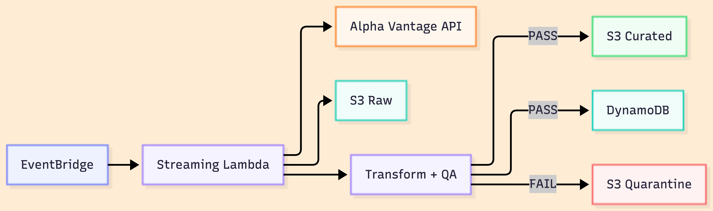
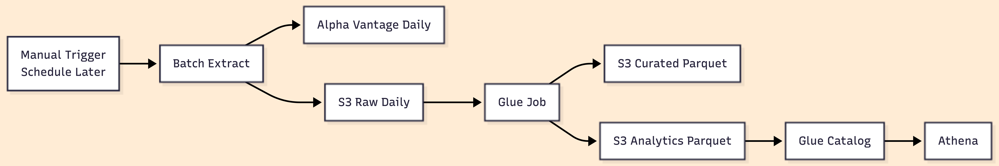

# Market Data Platform - Cloud Data Engineering Project

## Overview

This project implements a **cloud-native data engineering platform** focused on **market data**.

The goal is to build the project the way a real data engineering platform is structured in industry, while still keeping it approachable for students.

At a high level, this repository contains **two pipelines**:

- a **streaming pipeline** for near-real-time latest prices
- a **batch pipeline** for historical daily prices and analytics datasets

Both pipelines are designed with the same core data engineering principles:

- clear storage zones
- reproducible infrastructure with Terraform
- explicit compute layers
- data quality validation
- failure isolation through quarantine
- separation between local learning flow and cloud deployment flow

---

## What Exactly We Are Building

We are building a small but realistic **market data platform** with two complementary paths:

### 1. Streaming Path
Used for:
- ingesting the latest prices frequently
- validating them
- storing the cleaned result for low-latency serving

Final cloud shape:
- **EventBridge** triggers **Lambda**
- Lambda fetches latest prices from **Alpha Vantage**
- raw and curated records land in **S3**
- validated latest prices are served from **DynamoDB**
- failures go to **quarantine**

### 2. Batch Path
Used for:
- ingesting historical daily prices
- transforming them into analytics-ready datasets
- exposing them through an OLAP query layer

Final cloud shape:
- **Batch Extract Lambda** fetches historical daily prices from **Alpha Vantage**
- raw data lands in **S3**
- **AWS Glue** transforms raw data into curated and analytics Parquet datasets
- **Glue Data Catalog** registers the analytics table
- **Athena** queries the analytics dataset

---

## High-Level Pipeline Flow

### Streaming Pipeline



### Batch Pipeline



---

## Note on Project Intent

**This project is intentionally designed as a hands-on learning resource for students and practitioners who want to understand cloud-based data engineering through practice, not theory.**

It provides:
- an **end-to-end view** of how a data engineering project is structured
- clear, incremental steps showing how pipelines are:
  - designed
  - implemented locally
  - tested
  - deployed and operated on the cloud

This repository does **not** aim to explain data engineering concepts in theory.  
The focus here is purely **practical execution and workflow understanding**.

Each commit represents a **meaningful progression** in the project:
- how the repository structure evolves
- how components are added and wired together
- how local testing transitions into cloud deployment
- how validation and failure handling are introduced in real systems

The complexity of data engineering always depends on the use case. This project keeps the scope intentionally manageable, while still being realistic enough to demonstrate how a **production-style, end-to-end data pipeline** is built and operated in the cloud.

Treat this repository as a **reference implementation**: a concrete example of how the pieces fit together, rather than a universal blueprint.

---

## Learning Structure of the Repository

To make the project easier to follow for students, both pipelines are now split into:

- `common/`
- `local/`
- `cloud/`

Meaning:

- `common/` contains shared business logic
- `local/` contains the local learning runner and local-only helpers
- `cloud/` contains AWS-specific runtime entrypoints

This makes it easier to answer:

- what the pipeline does logically
- how the same logic is run locally
- how the same logic is deployed in the cloud

Helpful reading guides:

- `docs/streaming/execution_order.md`
- `docs/batch/execution_order.md`
- `docs/terraform_learning_order.md`

---

## Current Platform Status

### Streaming Pipeline Status

The streaming pipeline is **complete at the core platform level**.

Completed:
- local streaming pipeline
- cloud streaming Lambda deployment
- EventBridge scheduling
- S3 raw / curated / quarantine zones
- DynamoDB serving layer
- Great Expectations quality gate
- CloudWatch alarms and metrics
- real data ingestion via **Alpha Vantage + AWS Secrets Manager**

Status:
- **Streaming Pipeline**: ✅ COMPLETE for current project scope

### Batch Pipeline Status

The batch pipeline is **working end to end in AWS**, but still has one important analytics refinement left.

Completed:
- local batch pipeline
- real historical extract via **Batch Extract Lambda + Alpha Vantage + Secrets Manager**
- S3 raw daily landing
- Glue transform job
- Parquet curated output
- Parquet analytics output
- Glue Data Catalog registration
- Athena query validation

Still next:
- partition analytics output properly
- update partition-aware catalog handling
- strengthen cloud batch quality and observability

Status:
- **Batch Pipeline**: ✅ working end to end
- **Batch Analytics Refinement**: ⏳ next phase

---

## Steps Followed in the Project (Streaming Pipeline)

### Step 0: Initial Setup & Local Development
**Goal**: Establish a reproducible local development environment and validate core pipeline logic before touching the cloud.

**What was done**:
- Set up a local Python development environment using **Poetry**
- Defined a clear project structure aligned with future AWS deployment
- Implemented a **local streaming-style ingestion pipeline**
- Introduced a **canonical curated schema**
- Integrated **Great Expectations (GE)** to enforce data quality rules early

**Key design decision**:
> Data quality validation is treated as a **hard gate**.

**Status**: ✅ DONE

---

### Step 1: Local Streaming Pipeline (Raw -> Curated -> Quality Gate)

**Goal**: Prove the end-to-end streaming logic locally before deploying to AWS.

#### Pipeline Zones (Local)

- **Raw Zone** (`data/raw/`)
  - provider-format data
  - no assumptions, no validation

- **Curated Zone** (`data/curated/`)
  - cleaned and standardized records
  - stable schema used across the system

- **Quarantine Zone** (`data/quarantine/`)
  - records that fail data quality checks
  - preserved for inspection and debugging

#### Pipeline Flow

1. Fetch price data from the provider.
2. Write raw data to the raw zone.
3. Transform raw data into the curated schema.
4. Validate curated data using **Great Expectations**.
5. Route data:
   - **PASS** -> curated zone
   - **FAIL** -> quarantine zone

**Status**:
- **TASK-01**: Storage zone separation (raw / curated / quarantine) — ✅ DONE
- **TASK-02**: Great Expectations data quality gate — ✅ DONE
- **TASK-03**: Pass/fail routing logic with quarantine handling — ✅ DONE

---

### Step 2: AWS Infrastructure Provisioning (Terraform)

**Goal**: Provision production-style cloud infrastructure using Infrastructure as Code.

Provisioned:
- **S3 bucket** with logical zones
- **DynamoDB** table for latest prices
- **IAM role** for streaming Lambda
- AWS account tooling setup for Terraform and CLI usage

**Status**:
- **TASK-02.1**: AWS account setup, IAM user, MFA, billing safeguards — ✅ DONE
- **TASK-02.2**: Terraform provisioning for S3, DynamoDB, IAM — ✅ DONE

---

### Step 3: Cloud Streaming Pipeline

**Goal**: Deploy the validated local streaming pipeline to AWS and execute it end to end.

Implemented:
- Lambda containerization
- ECR repository and image push
- Lambda deployment through Terraform
- EventBridge scheduling
- CloudWatch alarms and custom metrics
- DynamoDB integration
- real Alpha Vantage ingestion via **AWS Secrets Manager**

Validated outcomes:
- Lambda executes successfully in AWS
- raw and curated data land in S3
- quality gate is enforced in cloud execution
- latest prices are stored in DynamoDB
- real market data ingestion is working

**Step 3 Status**:
- **TASK-03.1**: Lambda containerization & ECR push — ✅ DONE
- **TASK-03.2**: Lambda deployment via Terraform — ✅ DONE
- **TASK-03.3**: Cloud execution of streaming pipeline — ✅ DONE
- **TASK-03.4**: S3 + DynamoDB integration validated — ✅ DONE
- **TASK-03.5**: EventBridge scheduler implemented and validated — ✅ DONE
- **TASK-03.6**: CloudWatch alarms configured — ✅ DONE
- **TASK-03.7**: Direct CloudWatch metric emission from Lambda — ✅ DONE
- **TASK-03.8**: Storage liveness monitoring added — ✅ DONE
- **TASK-03.9**: Real market data ingestion via Alpha Vantage + Secrets Manager — ✅ DONE
- **TASK-03.10**: Final end-to-end streaming validation — ✅ DONE

**Overall Streaming Status**: ✅ DONE

---

## Steps Followed in the Project (Batch Pipeline)

### Goal

Build a batch analytics path that moves from:

- historical daily market data
- to curated daily records
- to analytics-ready Parquet
- to metadata registration
- to Athena querying

---

### Step 4: Local Batch Pipeline

**Goal**: Prove the end-to-end batch analytics logic locally before deploying the AWS batch path.

#### Pipeline Zones (Local)

- **Raw Zone** (`data/raw/prices_daily/`)
  - provider-format daily price records
  - preserved for lineage and replay

- **Curated Zone** (`data/curated/prices_daily/`)
  - standardized daily price dataset
  - canonical dataset for downstream use

- **Analytics Zone** (`data/analytics/ohlc_daily/`)
  - analytics-ready daily OHLC dataset
  - intended for Athena, OLAP analysis, ML feature engineering, and dashboards

- **Quarantine Zone** (`data/quarantine/batch/ohlc_daily/`)
  - failed analytics datasets that do not pass the quality gate

#### Local Batch Flow

1. Fetch historical daily prices.
2. Write provider-format records to the raw zone.
3. Normalize into the curated daily schema.
4. Produce the OHLC daily analytics output.
5. Validate the analytics output using Great Expectations.
6. Route output:
   - **PASS** -> analytics result remains official
   - **FAIL** -> quarantine zone

**Status**:
- **TASK-04.1**: Batch zone wiring (raw / curated / analytics / quarantine) — ✅ DONE
- **TASK-04.2**: Daily price normalization to curated schema — ✅ DONE
- **TASK-04.3**: OHLC daily analytics output generation — ✅ DONE
- **TASK-04.4**: Great Expectations gate on analytics output — ✅ DONE
- **TASK-04.5**: Pass/fail routing with quarantine handling — ✅ DONE

---

### Step 5: Batch Analytics Infrastructure

**Goal**: Provision the AWS analytics layer for the batch pipeline.

Provisioned:
- S3 batch prefixes
- Glue Data Catalog database
- Glue external table
- Athena workgroup

**Status**:
- **TASK-04.6**: S3 batch analytics prefixes provisioned — ✅ DONE
- **TASK-04.7**: Glue Data Catalog database created — ✅ DONE
- **TASK-04.8**: Glue external table registered — ✅ DONE
- **TASK-04.9**: Athena workgroup configured — ✅ DONE

---

### Step 6: Real Batch Extract + AWS Glue Transform

**Goal**: Move the batch path from a local-only concept into a real cloud batch pipeline.

Implemented:
- **Batch Extract Lambda**
  - calls Alpha Vantage historical daily endpoint
  - loads API key from **AWS Secrets Manager**
  - writes raw JSONL into `raw/prices_daily/`

- **Glue Transform Job**
  - reads the raw daily zone
  - writes **curated Parquet** to `curated/prices_daily/`
  - writes **analytics Parquet** to `analytics/ohlc_daily/`

- **Glue Catalog + Athena validation**
  - table updated to read Parquet
  - Athena query executed successfully against the analytics dataset

Validated outcomes:
- real Alpha Vantage historical data lands in S3
- Glue successfully reads the new nested raw layout
- Parquet output lands in curated and analytics zones
- Athena query succeeds against the batch analytics table

**Status**:
- **TASK-04.10**: Athena query validation performed — ✅ DONE
- **TASK-04.11**: Real batch extract Lambda implemented — ✅ DONE
- **TASK-04.12**: Glue updated to read real nested raw layout — ✅ DONE
- **TASK-04.13**: Batch AWS path validated end to end — ✅ DONE

---

## Current Batch Design Note

The current cloud batch flow is:

- **extract** -> Batch Extract Lambda
- **raw storage** -> S3
- **transform** -> AWS Glue
- **metadata** -> Glue Data Catalog
- **query** -> Athena

This separation is intentional.

Glue is kept **transform-only**.
It does **not** call Alpha Vantage directly.

---

## What We Still Need to Do Next

### Next Batch Step: Partitioned Analytics

The most important next step is:

- partition the analytics output properly

Recommended direction:
- `analytics/ohlc_daily/symbol=.../year=.../month=.../`

Then:
- update Glue Catalog partition handling
- rerun Athena validation
- add stronger batch cloud quality + observability

### Later Work

- finish analytics platform properly after partitioned batch output
- optional ML layer
- optional lightweight UI
- cost optimization and cleanup guidance

---

## Notes (How Local and Cloud Map to Each Other)

The local and cloud implementations are separated visually, but the conceptual flow is the same.

For example:

- local runner -> easier for learning and debugging
- cloud entrypoint -> easier for deployment and AWS operation
- shared logic -> easier to reason about the actual transformation and validation steps

This is why the repository now uses:

- `pipelines/streaming/ingest_lambda/local/`
- `pipelines/streaming/ingest_lambda/cloud/`
- `pipelines/streaming/ingest_lambda/common/`

and:

- `pipelines/batch/ohlc_daily/local/`
- `pipelines/batch/ohlc_daily/cloud/`
- `pipelines/batch/ohlc_daily/common/`

---

## Technologies Used So Far

- **AWS Lambda**
- **Elastic Container Registry (ECR)**
- **EventBridge**
- **S3**
- **DynamoDB**
- **Terraform**
- **Great Expectations**
- **Glue Data Catalog**
- **Athena**
- **AWS Glue**
- **AWS Secrets Manager**
- **Poetry + Python**

---

## How to Run Locally

1. Install dependencies using **Poetry**:

```bash
poetry install
```

2. Run the streaming pipeline locally:

```bash
poetry run python -m pipelines.streaming.ingest_lambda.local.app
```

3. Run the batch pipeline locally:

```bash
poetry run python -m pipelines.batch.ohlc_daily.local.app
```

---

## Security Note

- Secrets and environment-specific configuration are intentionally excluded.
- See `.env.example` and `terraform.tfvars.example` for required variables.

---

## License

This project is licensed under the company Fourth-Projection.
